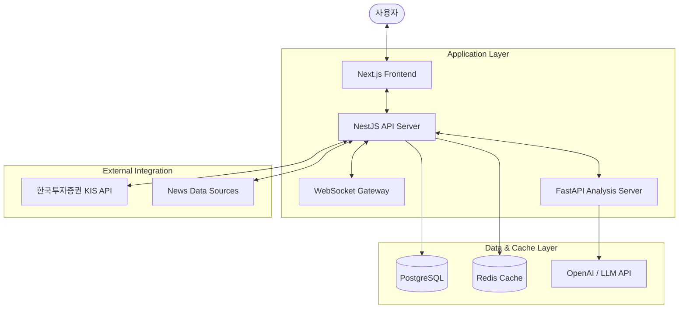

# 🏗️ InvestmentProject 아키텍처 및 상세 가이드

이 문서는 `InvestmentProject` (통합 투자 분석 플랫폼)의 설계 철학, 상세 구조, 기술적 중점 포인트 및 핵심 메커니즘을 총망라하여 설명합니다. 프로젝트에 처음 합류한 개발자가 시스템의 전체 파이프라인을 즉시 이해할 수 있도록 구성되었습니다.

---

## 🗺️ 1. 전체 시스템 구성 (System Configuration)

전체 시스템은 마이크로서비스 지향적 구조로 설계되었으며, 각 서비스는 Docker 컨테이너로 격리되어 관리됩니다.



### 🧩 3-Tier Layered Architecture
1.  **Presentation Tier (Frontend)**: Next.js 기반. 실시간 차트 시각화 및 AI 인터랙티브 UI 제공.
2.  **Application Tier (Backend & Analysis)**:
    - **NestJS Server**: 핵심 비즈니스 로직, 데이터베이스 관리, 실시간 웹소켓 중계 및 외부 데이터(KIS) 수집.
    - **FastAPI Server**: Python 기반 퀀트 분석(CAGR, MDD 계산) 및 AI 분석 엔진 심화 처리.
3.  **Data Tier**:
    - **PostgreSQL**: 영속성 데이터(회원, 채팅기록, 게시글, 관심종목) 저장.
    - **Redis**: 실시간 시세 캐싱 및 대역폭 최적화.

---

## 📂 2. 주요 폴더 구조 (Detailed Folder Structure)

프로젝트는 모노레포 스타일의 구조를 가지며, 각 디렉토리는 명확한 경계를 가집니다.

### 📁 1) Frontend (`/frontend/src/`)
FSD(Feature-Sliced Design) 패턴을 차용하여 기능 단위로 응집도를 높였습니다.
```
src/
├── app/                  # (Routing) Next.js App Router 기반 페이지 구성
├── features/             # (Business Logic) 기능별 핵심 모듈 (auth, chat, community, news, stocks, watchlist)
│   ├── [feature]/
│   │   ├── components/   # 해당 기능 전용 UI
│   │   ├── hooks/        # React Query 및 기능 전용 로직
│   │   └── services/     # API 통신 함수
├── shared/               # (Common) 공용 UI 컴포넌트, API 설정(Axios), 유틸리티
└── store/                # (UI State) Zustand를 이용한 전역 상태 관리
```

### 📁 2) Backend (`/backend/src/`)
NestJS의 모듈 시스템을 통해 도메인 간 결합도를 낮추었습니다.
```
src/
├── main.ts               # 진입점 및 전역 설정
├── app.module.ts         # 최상위 루트 모듈
├── config/               # DB 및 API 환경 설정
├── modules/              # (Domain) 기능별 독립 모듈
│   ├── auth/             # 인증 및 인가 (Passport, JWT)
│   ├── stocks/           # KIS API 연동, 시세 수집, 랭킹 관리
│   ├── chat/             # AI 챗봇 세션 및 프롭트 관리
│   ├── news/             # 뉴스 크롤링 및 카테고리 필터링
│   └── websocket/        # Socket.io를 활용한 실시간 중계
```

### 📁 3) Analysis Server (`/analysis-server/app/`)
AI 및 데이터 분석에 특화된 Python 환경입니다.
```
app/
├── main.py               # FastAPI 진입점
├── routers/              # API 엔드포인트 (strategy, profile, trades)
├── services/             # 분석 로직 (Pandas기반 분석, LLM 엔진)
└── schemas/              # Pydantic 기반 데이터 모델
```

---

## 🧱 3. 모듈 단위 상세 구조 (Module Detailed Structure)

### ⚙️ 백엔드 모듈 (NestJS Module Pattern)
각 도메인은 다음의 구조를 엄격히 따릅니다:
1.  **`xx.controller.ts` (Entry)**: HTTP 요청 수신, DTO 검증 및 서비스 호출.
2.  **`xx.service.ts` (Logic)**: 핵심 비즈니스 로직 처리, 외부 API 호출, DB 연산.
3.  **`entities/xx.entity.ts` (Schema)**: TypeORM을 이용한 DB 테이블 정의 및 관계 설정.
4.  **`xx.module.ts` (Registry)**: 서비스, 컨트롤러 및 의존성 등록.

### ⚛️ 프론트엔드 기능 (Feature Pattern)
새로운 기능을 추가할 때 `features/[domain]` 아래에 위치시키며 독립성을 유지합니다.
-   **Services**: `Axios`를 통한 백엔드 API와의 1:1 매칭 통신 로직.
-   **Hooks**: `TanStack Query`를 이용한 데이터 페칭 및 캐시 라이프사이클 관리.
-   **Components**: 해당 도메인의 복잡한 UI 블록 (예: `StockChart`, `ChatWindow`).

---

## 🛠️ 4. 주요 프로젝트 구조 및 중점 포인트

### 💡 프론트엔드 중점 사항
-   **Optimistic UI**: 채팅이나 댓글 작성 시 서버 응답 전 화면을 즉시 갱신하여 초저지연 경험을 제공합니다.
-   **Real-time Hydration**: WebSocket으로 수신된 데이터를 `queryClient.setQueryData`를 통해 기존 API 데이터와 실시간으로 병합합니다.
-   **Performance Optimization**: 대규모 주식 리스트 렌더링 시 `Windowing` 기법을 적용하여 메모리 사용량을 최소화합니다.

### 💡 백엔드 중점 사항
-   **KIS API Rate Limiting**: 초당 호출 제한이 있는 외부 API(한국투자증권)를 위해 `Queue` 메커니즘을 도입, 호출 주기를 자동 조절합니다.
-   **Token Lifecycle**: 엑세스 토큰의 만료 시간을 추적하여 자동으로 갱신(Refresh)하는 백그라운드 프로세스가 구현되어 있습니다.
-   **WebSocket Multiplexing**: 한 클라이언트가 여러 종목의 시세를 효율적으로 구독할 수 있도록 커스텀 게이트웨이를 설계했습니다.

---

## ⚙️ 5. 핵심 메커니즘 (Core Mechanisms)

### 🔄 A. 실시간 데이터 파이프라인 (The Pulse)
1.  **Subscription**: 클라이언트가 특정 종목 코드를 브로드캐스팅 채널에 구독 요청합니다.
2.  **Polling & De-duplication**: 백엔드는 KIS API로부터 시세를 가져옵니다. 다수의 사용자가 동일 종목을 요청할 경우 API 호출은 1회로 통합(Deduplication)됩니다.
3.  **Redis Cache**: 수신된 최신 시세는 Redis에 짧은 생명주기(TTL)로 저장되어 API 서버의 부하를 획기적으로 낮춥니다.
4.  **Broadcast**: 새로운 데이터가 도착하는 즉시 WebSocket을 통해 모든 타겟 클라이언트에게 전송됩니다.

### 🤖 B. AI 투자 인사이트 생성 (The Brain)
1.  **Context Assembly**: 백엔드의 `AnalysisService`가 해당 종목의 현재가, 최근 뉴스(5개), 유저의 투자 성향을 수집합니다.
2.  **Prompt Engineering**: 수집된 데이터를 바탕으로 LLM에게 전문 분석을 요청하는 구조화된 프롬프트를 생성합니다.
3.  **JSON Structural Output**: AI가 반드시 지정된 JSON 구조로 응답하도록 강제하며, 백엔드는 이를 파싱하여 점수(Score)와 근거(Reason)로 시각화합니다.

---

## 🚀 6. 프로젝트 구성 및 환경 설정 (Setup & Config)

### 🐳 Docker Compose 실행
전체 환경을 단일 명령어로 실행할 수 있도록 오케스트레이션 되어 있습니다.
```bash
docker-compose up -d
```
-   **Port Mapping**:
    -   Frontend: `3000`
    -   Backend: `8000`
    -   Analysis Server: `8001`
    -   Postgres: `5432` / Redis: `6379`

### 🔑 환경 변수 (`.env`)
프로젝트 루트의 `.env` 파일을 통해 다음 중요 설정을 관리합니다.
-   `KIS_APP_KEY`, `KIS_SECRET`: 한국투자증권 API 연동 키
-   `OPENAI_API_KEY`: AI 엔진 연동 키
-   `DB_URL`, `REDIS_URL`: 인프라 연결 정보

---

> 이 `ARCHITECTURE.md` 문서는 프로젝트의 발전에 따라 지속적으로 업데이트됩니다. 새로운 아키텍처적 결정이나 대규모 기능 추가 시 반드시 이 문서를 선행적으로 업데이트해 주세요.
