# FinSight - AI 기반 투자 분석 플랫폼

FinSight는 실시간 주식 데이터와 AI 기술을 결합하여 개인 투자자들에게 심도 있는 시장 통찰력을 제공하는 올인원 투자 플랫폼입니다.

## 🚀 주요 기능

### 1. 실시간 대시보드

*   **실시간 종목 랭킹**: 거래대금, 등락률 기준 실시간 인기 종목 확인.
*   **종목 검색**: 전 종목(KOSPI, KOSDAQ) 검색 및 빠른 이동.
*   **AI 시장 분석**: 오늘의 시장 흐름에 대한 실시간 AI 요약 정보 제공.

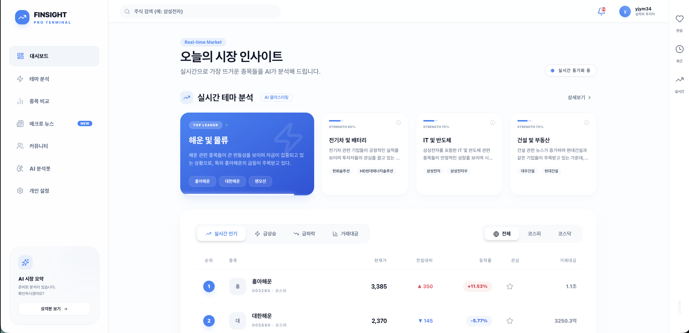
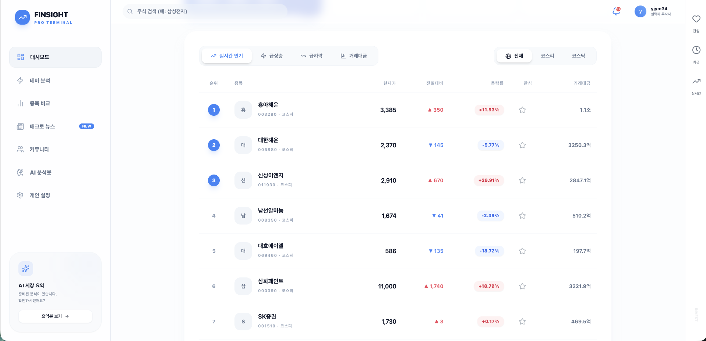

### 2. 테마 분석

* **테마 분석**: 실시간으로 변화하는 시장의 테마를 분석하고, 관련 종목들을 한눈에 파악할 수 있습니다.

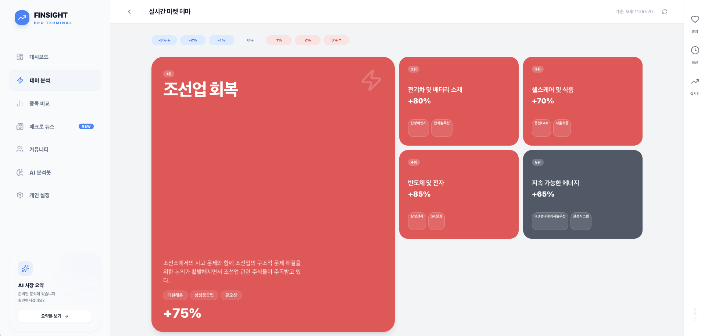

### 3. 세부 종목 분석 및 AI 인사이트

*   **종합 정보**: 차트, 재무 지표, 최신 뉴스, 공시 정보를 한눈에 파악.
*   **AI 리서치**: OpenAI 기반의 종목별 매력도 점수 및 핵심 투자 포인트 요약.
*   **투자자 매매동향**: 개인, 외국인, 기관의 실시간 매매 동향 차트.

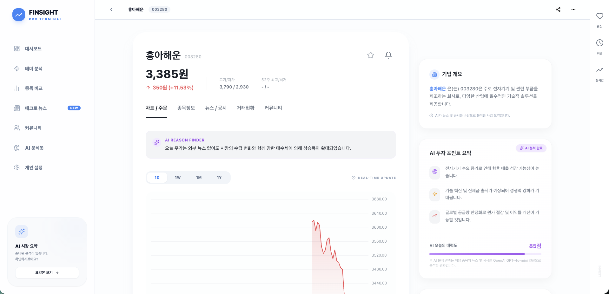
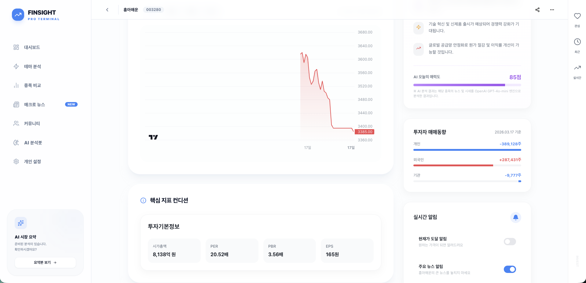

### 4. 종목 비교 분석 도구

*   **멀티 비교**: 최대 5개 종목의 재무 지표(PER, PBR 등) 대조 설명.
*   **상대 수익률 차트**: 최근 1년 수익률 추이를 동일 시점에서 비교.
*   **AI 통합 분석**: 선택한 종목들 간의 상대적 우위와 리스크 요인 분석.

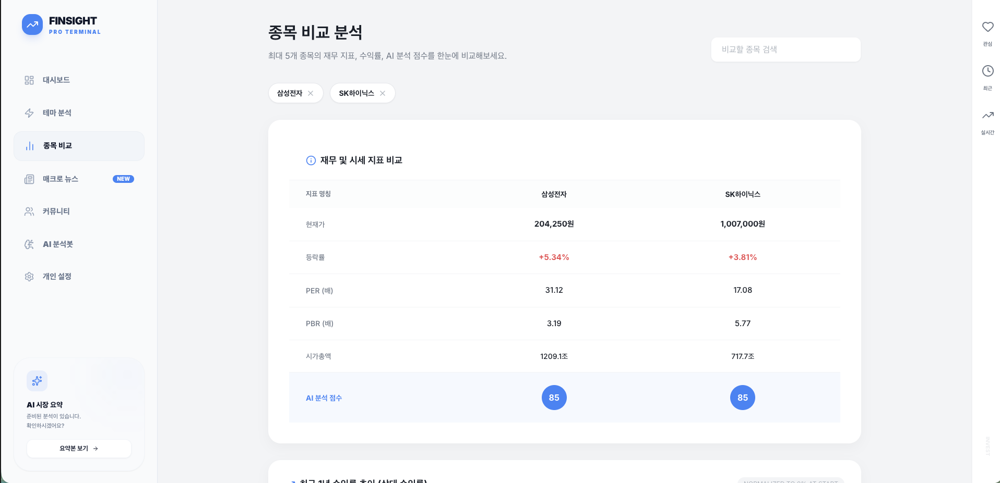
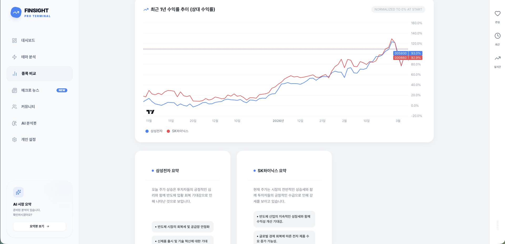

### 5. 뉴스 및 커뮤니티

*   **뉴스**: 실시간 뉴스 확인.
*   **종목 토론**: 특정 종목과 연계된 게시글 작성 및 정보 공유.

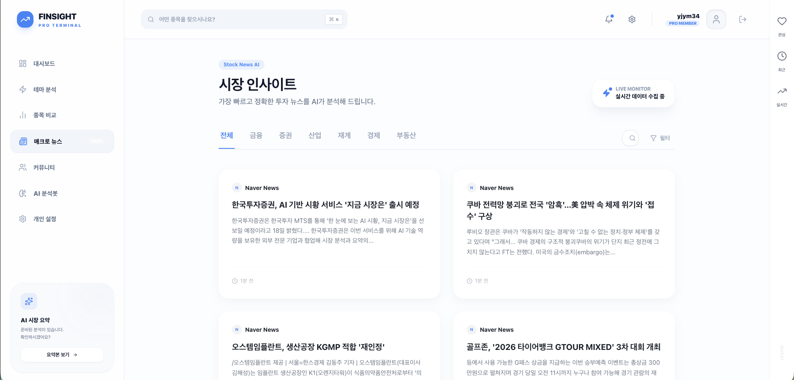
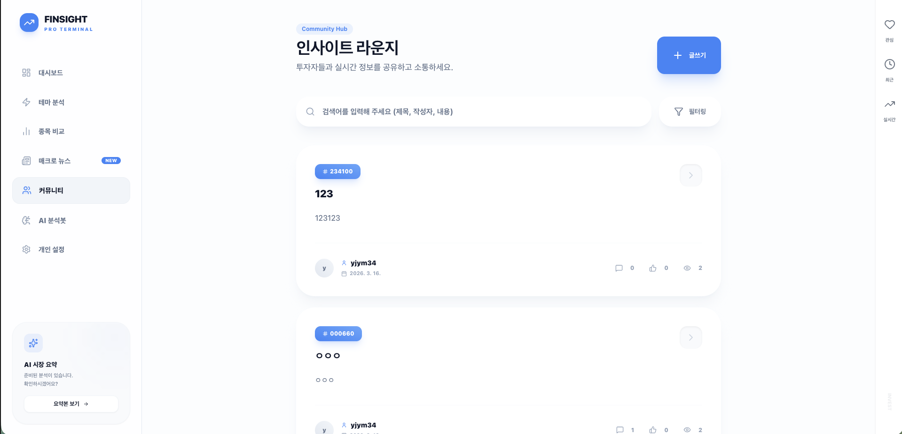

### 6. 챗봇
*   **투자봇**: AI에게 투자와 관련된 질문을 할수 있습니다.

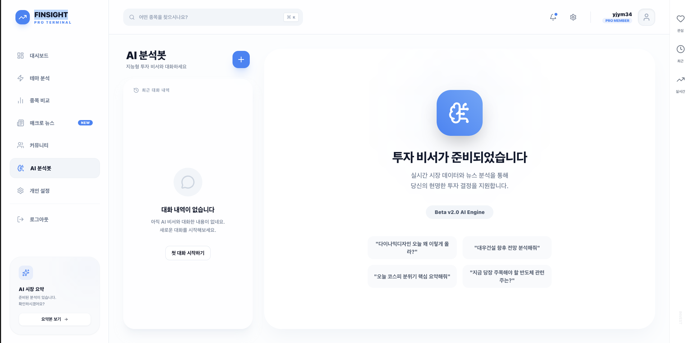

### 7. 설정
*   **비밀번호 변경** : 비밀번호를 변경할 수 있습니다.
*   **AI 응답 설정** : AI 응답을 설정할 수 있습니다.
*   **테마 설정 및 차트 설정** : 테마 및 차트 표시를 설정할 수 있습니다.
*   **WebSocket 기반 실시간 알림 설정**: 내가 쓴 글에 반응이 올 때 브라우저 실시간 팝업 안내.

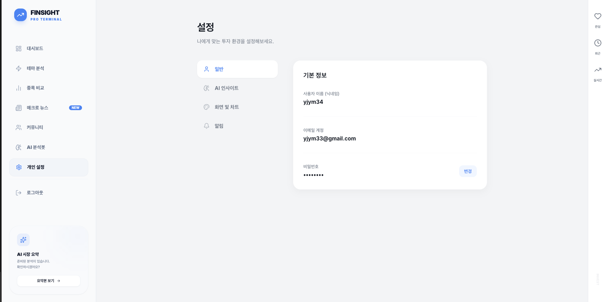
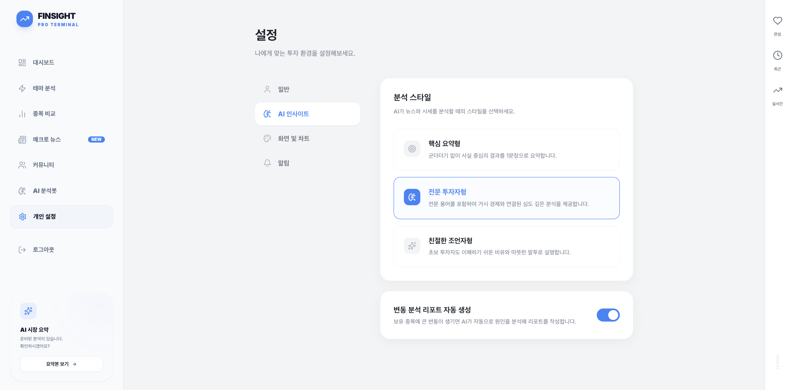
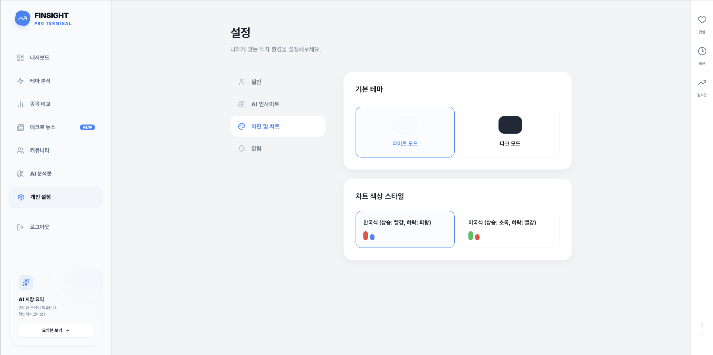
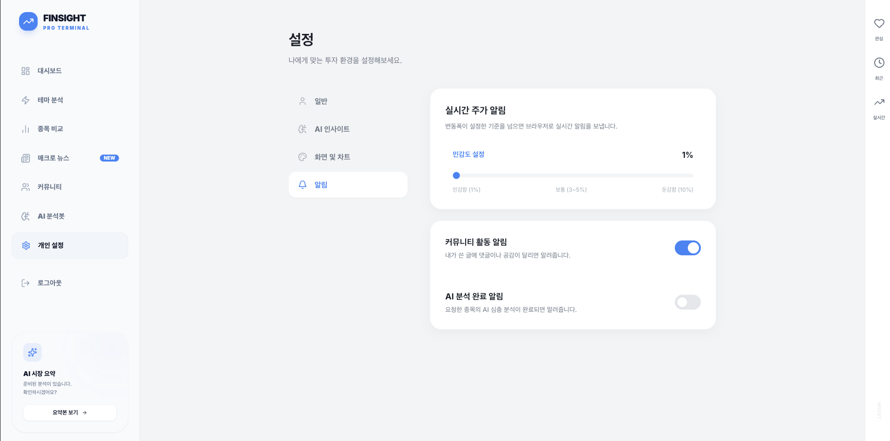

### 8. 우측 사이드바
*  **관심종목**
* **최신 본 목록**
* **실시간 인기종목**

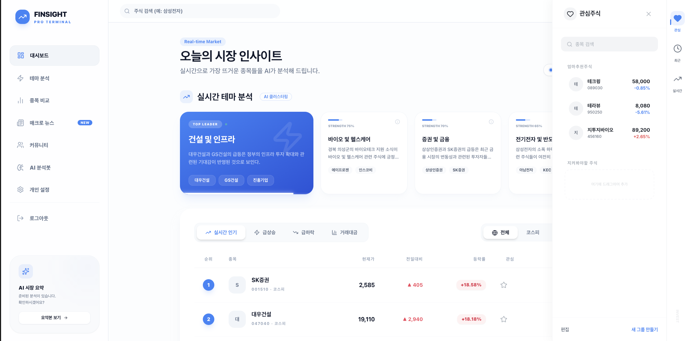


## 🛠 기술 스택

### Frontend
- **Framework**: Next.js (App Router)
- **State Management**: Zustand, React Query
- **Styling**: Shadcn UI, Tailwind CSS, Framer Motion (Animations)
- **Real-time**: Socket.io-client

### Backend
- **Framework**: NestJS
- **Database**: PostgreSQL (TypeORM)
- **Authentication**: JWT, Passport
- **AI Integration**: OpenAI API
- **Real-time**: Socket.io

## 📦 설치 및 실행 방법

### Backend 설정
```bash
cd backend
npm install
# .env 파일 생성 및 DB 설정
npm run start:dev
```

### Frontend 설정
```bash
cd frontend
npm install
npm run dev
```

---
본 프로젝트는 지속적으로 고도화되고 있으며, 더 많은 AI 분석 모델과 사용자 인터랙션 기능을 추가할 예정입니다.
